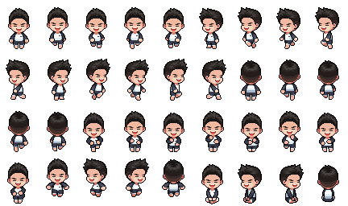

# Pixel Agent Desk 👾

Claude CLI와 실시간으로 동기화되어 에이전트의 상태를 귀여운 픽셀 아트로 보여주는 데스크톱 애플리케이션입니다.



## 🌟 주요 기능

- **실시간 상태 동기화**: Claude Code의 Hook 시스템을 이용해 에이전트가 생각 중인지, 일하는 중인지, 사용자 답변을 기다리는지 즉시 반영합니다.
- **실시간 타이머**: 작업 중에는 경과 시간을(`Working... (01:20)`), 완료 후에는 최종 소요 시간을(`Done! (02:45)`) 실시간으로 표시합니다.
- **5가지 핵심 상태 라벨**:
  - `Waiting...`: 새로운 세션 시작 전이나 대화 종료 후 대기 상태
  - `Working...`: 프롬프트 처리, 도구 사용, 서브 에이전트 가동 중
  - `Done!`: 모든 작업이 성공적으로 완료됨
  - `Error!`: 도구(Tool) 실행 중 오류가 발생한 상태
  - `Help!`: 권한 승인 대기 또는 알림 확인 필요
- **최상단 유지 (Always on Top)**: 터미널 작업 중에도 언제나 캐릭터를 볼 수 있도록 화면 최상단에 고정됩니다.
- **캐릭터 드래그**: 마우스로 캐릭터를 원하는 위치로 드래그하여 배치할 수 있습니다.
- **화면 경계 스냅**: 캐릭터가 화면 밖으로 나가는 것을 자동으로 방지합니다.

## 🚀 시작하기

### 1. 설치
```bash
npm install
```

### 2. 실행
```bash
npm start
# 또는
npm run dev
# 또는
npx electron .
```

### 3. Claude Code 설정
앱을 실행하면 자동으로 `~/.claude/settings.json`에 필요한 HTTP 훅이 등록됩니다. 별도의 수동 설정 없이도 Claude CLI를 실행하면 에이전트가 반응합니다.

## 🛠 기술 스택
- **Framework**: Electron 32.0.0
- **Runtime**: Node.js
- **Frontend**: Vanilla JS, CSS (Glassmorphism & Pixel Art Rendering)
- **Integration**: Claude Code Hook API (HTTP)

## 📁 프로젝트 구조

```
pixel-agent-desk/
├── main.js           # Electron 메인 프로세스, HTTP 서버, 훅 관리
├── server.js         # HTTP 서버, 상태 매핑, API 라우팅
├── renderer.js       # 애니메이션 엔진, 타이머 로직, 상태 업데이트
├── preload.js        # IPC 통신 브릿지 (contextBridge)
├── index.html        # UI 구조
├── styles.css        # 디자인 시스템 (Glassmorphism, 픽셀 렌더링, drag)
├── package.json      # 의존성 관리
└── avatar_00.png     # 픽셀 캐릭터 스프라이트 시트 (48x64, 9x4 프레임)
```

## 🔧 HTTP API

### POST /agent/status
에이전트 상태 업데이트를 수신합니다.

```json
{
  "session_id": "string",
  "hook_event_name": "string",
  "message": "string"
}
```

### GET /agent/states
현재 에이전트 상태를 조회합니다.

### GET /health
서버 상태를 확인합니다.

## 📋 구현 현황

### ✅ 구현 완료
- 실시간 상태 동기화 (Claude Hooks)
- 자동 훅 등록 (기존 설정 보존)
- 투명 배경 + Always on Top
- 캐릭터 드래그 기능
- 실시간 타이머 (작업 중 경과 시간, 완료 후 최종 시간)
- 화면 경계 스냅
- 백그라운드 애니메이션 최적화
- 5가지 상태 애니메이션 (Waiting, Working, Done, Error, Help)

### ⏳ 계획 중 / 미구현
- 터미널 포커스 기능 (캐릭터 클릭 시 터미널 창 포커스)
- 멀티 세션 지원 (여러 터미널 → 여러 캐릭터)
- 설정 UI (포트, 창 크기 등)
- 애니메이션 속도 조절
- 다크/라이트 모드 지원

## 📄 라이선스
MIT License
